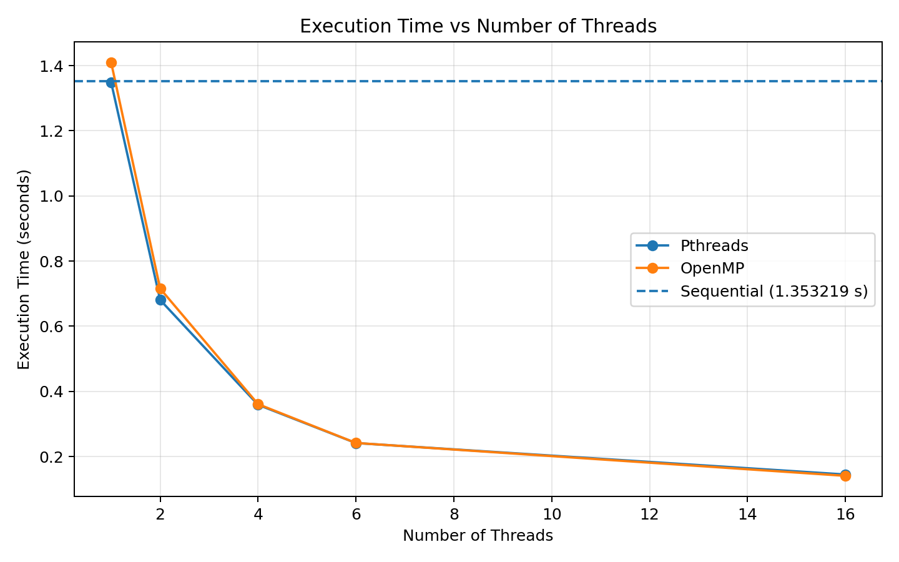
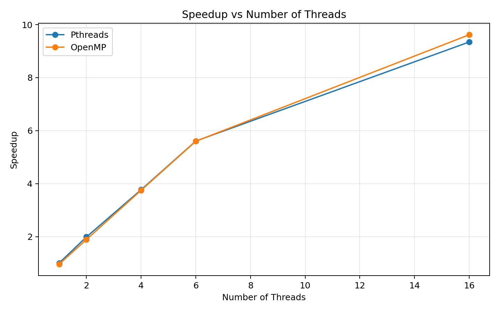
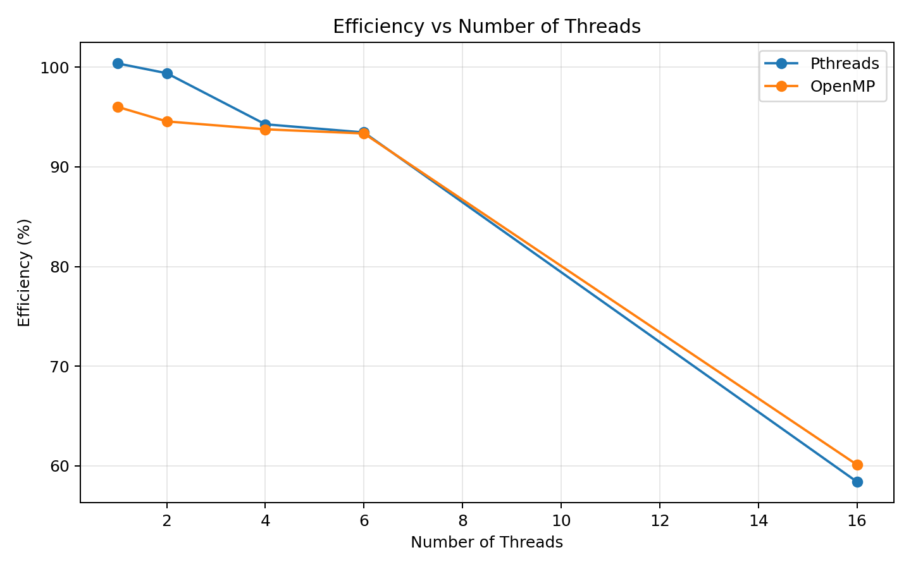

# PGC Experiment 2 — Multithreading Using Pthreads and OpenMP

## Aim

To study and implement multithreading using **POSIX Threads (Pthreads)** and **OpenMP**, and to understand thread creation, work distribution, race conditions, synchronization, reduction, barriers, and parallel performance.

---

## Objectives

* Create and manage multiple threads using Pthreads.
* Understand how work is distributed among threads.
* Demonstrate race conditions in multithreaded programs.
* Resolve race conditions using mutex synchronization.
* Implement parallel programs using OpenMP.
* Use OpenMP reduction for parallel summation.
* Demonstrate OpenMP race conditions.
* Use OpenMP critical sections for synchronization.
* Use OpenMP barriers for thread synchronization.
* Measure and compare sequential, Pthreads, and OpenMP performance.
* Calculate speedup and parallel efficiency.
* Compare Pthreads and OpenMP scalability.

---

# 1. Theoretical Background

## 1.1 Multithreading

Multithreading is a programming technique in which multiple threads execute concurrently within the same process.

A thread is a lightweight execution unit that shares the process's memory and resources with other threads.

Multithreading can improve performance by allowing independent portions of a program to execute simultaneously on multiple CPU cores.

---

## 1.2 Pthreads

**POSIX Threads (Pthreads)** is a standard thread API available on Unix/Linux systems.

Common Pthread functions include:

```c
pthread_create()
pthread_join()
pthread_exit()
```

`pthread_create()` creates a new thread, while `pthread_join()` waits for a thread to complete.

---

## 1.3 OpenMP

**OpenMP (Open Multi-Processing)** is an API for shared-memory parallel programming.

OpenMP uses compiler directives such as:

```c
#pragma omp parallel
```

and

```c
#pragma omp parallel for
```

It provides a simpler approach to parallel programming compared with manually managing Pthreads.

---

## 1.4 Race Condition

A race condition occurs when multiple threads access shared data concurrently and at least one thread modifies the data.

The final result can depend on the order in which threads execute.

---

## 1.5 Mutex

A **mutex (mutual exclusion lock)** protects a critical section so that only one thread can access the protected shared resource at a time.

Typical Pthread mutex functions are:

```c
pthread_mutex_lock()
pthread_mutex_unlock()
```

---

## 1.6 Critical Section

A critical section is a portion of code that accesses shared data and must not be executed simultaneously by multiple threads.

OpenMP provides:

```c
#pragma omp critical
```

to protect critical sections.

---

## 1.7 Reduction

OpenMP reduction allows multiple threads to calculate partial results independently and combine them into a final result.

Example:

```c
#pragma omp parallel for reduction(+:sum)
```

This is useful for operations such as summation.

---

## 1.8 Barrier Synchronization

A barrier forces all participating threads to wait until every thread reaches the barrier.

OpenMP provides:

```c
#pragma omp barrier
```

This ensures that no thread proceeds beyond the synchronization point until all required threads have arrived.

---

# 2. Software Environment

| Component            | Configuration            |
| -------------------- | ------------------------ |
| Programming Language | C                        |
| Compiler             | GCC                      |
| Thread Library       | POSIX Threads (Pthreads) |
| Parallel API         | OpenMP                   |
| Operating System     | Linux / Ubuntu           |
| Version Control      | Git                      |
| Repository           | PGC-EXPERIMENT-2         |

---

# 3. Part A — Pthreads

## 3.1 Basic Thread Creation

### `thread1.c`

Demonstrates the basic creation and execution of a Pthread.

Important functions:

```c
pthread_create()
pthread_join()
```

The main program creates a thread and waits for its completion.

---

## 3.2 Multiple Threads

### `thread2.c`

Demonstrates creation of multiple Pthreads.

Multiple threads execute concurrently, demonstrating the basic concept of parallel execution.

---

## 3.3 Parallel Work Distribution

### `thread_sum.c`

This program divides a summation workload among multiple threads.

Each thread processes a portion of the data, and the partial results are combined to obtain the final sum.

This demonstrates how a large computational task can be divided among multiple threads.

---

## 3.4 Pthread Race Condition

### `race.c`

This program demonstrates a race condition.

Multiple threads access and modify a shared variable without synchronization.

Because the operations are not protected, the final result can differ from the expected result.

---

## 3.5 Pthread Mutex Synchronization

### `mutex.c`

This program fixes the race condition demonstrated in `race.c`.

A mutex is used to protect the critical section:

```c
pthread_mutex_lock()
```

The shared resource is accessed safely and then released using:

```c
pthread_mutex_unlock()
```

This ensures mutual exclusion.

---

# 4. Part B — OpenMP

## 4.1 Basic OpenMP Parallelism

### `omp1.c`

Demonstrates the basic OpenMP parallel region.

The program uses OpenMP directives to create multiple threads and execute code concurrently.

---

## 4.2 OpenMP Reduction

### `omp_sum.c`

Demonstrates parallel summation using OpenMP reduction.

The reduction operation allows each thread to maintain a private partial sum and safely combine the results.

---

## 4.3 OpenMP Race Condition

### `omp_race.c`

Demonstrates a race condition when multiple OpenMP threads update shared data without proper synchronization.

The result may be incorrect because multiple threads can access the shared variable at the same time.

---

## 4.4 OpenMP Critical Section

### `omp_critical.c`

Demonstrates how an OpenMP critical section can be used to protect shared data.

The directive:

```c
#pragma omp critical
```

ensures that only one thread executes the protected section at a time.

---

## 4.5 OpenMP Barrier

### `omp_barrier.c`

Demonstrates barrier synchronization.

The directive:

```c
#pragma omp barrier
```

causes threads to wait until all participating threads reach the barrier.

---

# 5. Part C — Performance Analysis

Performance was measured using a large summation workload.

The sequential implementation was used as the baseline.

### Sequential Baseline

```text
Sequential execution time = 1.353219 seconds
```

The parallel implementations were tested with different numbers of threads.

---

## 5.1 Performance Results

| Threads | Pthreads Time (s) | OpenMP Time (s) |
| ------: | ----------------: | --------------: |
|       1 |          1.348142 |        1.409294 |
|       2 |          0.680737 |        0.715560 |
|       4 |          0.358872 |        0.360803 |
|       6 |          0.241345 |        0.241608 |
|      16 |          0.144812 |        0.140692 |

The execution time generally decreases as the number of threads increases.

---

# 6. Speedup Analysis

Speedup is calculated using:

```text
Speedup = Sequential Time / Parallel Time
```

Using the sequential execution time of **1.353219 seconds**:

| Threads | Pthreads Speedup | OpenMP Speedup |
| ------: | ---------------: | -------------: |
|       1 |            1.004 |          0.960 |
|       2 |            1.988 |          1.891 |
|       4 |            3.771 |          3.751 |
|       6 |            5.608 |          5.601 |
|      16 |            9.345 |          9.618 |

The results show that increasing the number of threads provides significant speedup for this workload.

---

# 7. Parallel Efficiency

Parallel efficiency is calculated as:

```text
Efficiency = (Speedup / Number of Threads) × 100
```

| Threads | Pthreads Efficiency | OpenMP Efficiency |
| ------: | ------------------: | ----------------: |
|       1 |             100.38% |            96.02% |
|       2 |              99.39% |            94.56% |
|       4 |              94.27% |            93.76% |
|       6 |              93.45% |            93.35% |
|      16 |              58.40% |            60.11% |

Efficiency decreases at higher thread counts because of parallel overhead, synchronization, scheduling, and limitations in available CPU resources.

---

# 8. Performance Graphs

The following graphs are included in the `images` directory.

### Execution Time vs Threads



This graph shows the reduction in execution time as the number of threads increases.

### Speedup vs Threads



This graph shows the improvement in performance relative to the sequential implementation.

### Efficiency vs Threads



This graph shows how parallel efficiency changes with increasing thread count.

---

# 9. Pthreads vs OpenMP

| Feature             | Pthreads                       | OpenMP                              |
| ------------------- | ------------------------------ | ----------------------------------- |
| Programming model   | Explicit thread management     | Directive-based                     |
| Thread creation     | Manual                         | Mostly automatic                    |
| Synchronization     | Mutexes and other Pthread APIs | Critical, barrier, reduction, etc.  |
| Ease of programming | More complex                   | Simpler                             |
| Control             | Fine-grained                   | Higher-level                        |
| Portability         | POSIX systems                  | Broad compiler support              |
| Best suited for     | Detailed thread control        | Rapid shared-memory parallelization |

Pthreads provides greater control over thread creation and synchronization, while OpenMP simplifies parallel programming through compiler directives.

---

# 10. Important Terminology

### Thread

A lightweight execution unit within a process.

### Parallelism

Executing multiple independent operations simultaneously.

### Concurrency

Multiple tasks making progress during overlapping periods of execution.

### Race Condition

An error caused by unsynchronized access to shared data.

### Mutex

A synchronization mechanism that provides mutual exclusion.

### Critical Section

A section of code that accesses shared resources and requires synchronization.

### Reduction

A parallel operation that combines individual thread results into a single result.

### Barrier

A synchronization point where threads wait for one another.

### Speedup

The performance improvement obtained by using parallel execution compared with sequential execution.

### Efficiency

The utilization of available parallel processing resources.

---

# 11. Repository Structure

```text
PGC-EXPERIMENT-2/
│
├── README.md
├── .gitignore
│
├── mutex.c
├── omp1.c
├── omp_barrier.c
├── omp_critical.c
├── omp_perf.c
├── omp_race.c
├── omp_sum.c
├── pthread_perf.c
├── race.c
├── thread1.c
├── thread2.c
└── thread_sum.c
│
└── images/
    ├── 01_pthread_single_thread.png
    ├── 02_pthread_multiple_threads.png
    ├── 03_pthread_work_distribution_sum.png
    ├── 04_pthread_race_condition.png
    ├── 05_pthread_mutex_fixed.png
    ├── 06_omp_parallel_performance_4threads.png
    ├── 06_pthread_performance.png
    ├── 07_omp_sum_reduction.png
    ├── 08_omp_race_condition.png
    ├── 09_omp_critical_section.png
    ├── 10_omp_barrier_synchronization.png
    ├── 11_omp_performance_1_2_4_8_threads.png
    ├── 12_pthread_performance_code_part2.png
    ├── 13_sequential_code_output.png
    ├── 14_sequential_output.png
    ├── 15_pthread_performance_code_part1.png
    ├── 16_pthread_performance_4threads_output.png
    ├── execution_time_vs_threads.png
    ├── speedup_vs_threads.png
    └── efficiency_vs_threads.png
```

---

# 12. Compilation and Execution

## Pthreads

Compile using:

```bash
gcc thread1.c -o thread1 -pthread
```

Run:

```bash
./thread1
```

For the other Pthread programs:

```bash
gcc thread2.c -o thread2 -pthread
gcc thread_sum.c -o thread_sum -pthread
gcc race.c -o race -pthread
gcc mutex.c -o mutex -pthread
gcc pthread_perf.c -o pthread_perf -pthread
```

Run the required executable using:

```bash
./thread2
./thread_sum
./race
./mutex
./pthread_perf
```

---

## OpenMP

Compile using GCC with the `-fopenmp` option:

```bash
gcc omp1.c -o omp1 -fopenmp
```

Other OpenMP programs:

```bash
gcc omp_sum.c -o omp_sum -fopenmp
gcc omp_race.c -o omp_race -fopenmp
gcc omp_critical.c -o omp_critical -fopenmp
gcc omp_barrier.c -o omp_barrier -fopenmp
gcc omp_perf.c -o omp_perf -fopenmp
```

Run:

```bash
./omp1
./omp_sum
./omp_race
./omp_critical
./omp_barrier
./omp_perf
```

---

# 13. Observations

1. Pthreads provides explicit control over thread creation and synchronization.
2. OpenMP provides a simpler directive-based approach to shared-memory parallelism.
3. Unsynchronized shared-variable access can produce race conditions.
4. Mutexes can protect shared data in Pthread programs.
5. OpenMP critical sections provide mutual exclusion.
6. OpenMP reduction provides an efficient way to perform parallel summation.
7. Barriers synchronize the progress of multiple threads.
8. Increasing the number of threads generally reduces execution time for the tested workload.
9. Speedup increases as more threads are used, although it is not perfectly linear.
10. Parallel efficiency decreases at higher thread counts because of overhead and hardware limitations.

---

# 14. Conclusion

This experiment demonstrated multithreading using both **Pthreads** and **OpenMP**.

Pthreads demonstrated explicit thread creation, work distribution, race conditions, and mutex-based synchronization. OpenMP demonstrated parallel regions, reduction, race conditions, critical sections, and barrier synchronization.

The performance analysis showed that both approaches can significantly reduce execution time compared with sequential execution. For the tested workload, increasing the number of threads produced substantial speedup, while efficiency decreased at higher thread counts due to parallel overhead and hardware limitations.

Overall, **Pthreads provides fine-grained control over threads and synchronization**, whereas **OpenMP provides a simpler and more convenient model for shared-memory parallel programming**.
